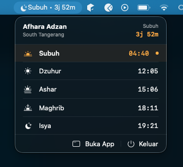
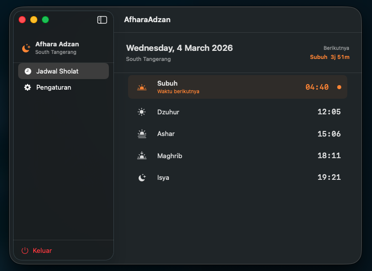

# Afhara Adzan

A minimal macOS menu bar app for Islamic prayer time reminders. Lives quietly in your status bar and notifies you when it's time to pray.


---

## Screenshots

| Menu Bar | Desktop |
|----------|---------|
|  |  |

---

## Features

- **Status bar countdown** — shows next prayer name and time remaining, updates every second
- **Prayer schedule** — all 5 fardhu prayers calculated for your current location
- **Adzan audio** — plays MP3 at prayer time, stoppable from the menu bar
- **Banner notifications** — macOS notification at each prayer time
- **Auto location** — detects your city via GPS, or set manually
- **Kemenag RI method** — Fajr 20°, Isha 18°, Shafi'i madhab

---

## Calculation Method

Uses the **Kemenag RI** (Indonesian Ministry of Religious Affairs) astronomical algorithm based on the Jean Meeus solar position formula.

| Parameter | Value |
|-----------|-------|
| Fajr      | 20° below horizon |
| Sunrise   | −0.833° |
| Asr       | Shafi'i (shadow factor 1×) |
| Maghrib   | −0.833° |
| Isha      | 18° below horizon |

---

## Requirements

- macOS 14 or later
- Xcode 15 or later (to build from source)

---

## Installation

**Build from source:**

```bash
git clone https://github.com/irwancannadys/afhara-adzan.git
cd afhara-adzan/AfharaAdzan
open AfharaAdzan.xcodeproj
```

Then press **⌘R** in Xcode.

> **Note:** Add your own adzan MP3 file at `AfharaAdzan/Resources/Sounds/adzan_makkah.mp3` before building.

---

## Usage

1. App appears in the **status bar** — click the icon to view the prayer schedule
2. Click **Buka App** to open the full desktop window
3. Open **Pengaturan** to configure location, notifications, and sound
4. **Stop Adzan** button appears automatically in the menu bar when audio is playing

---

## Architecture

Built with SwiftUI using `@Observable` + `@MainActor` (Swift 5.9).

```
AfharaAdzanApp
├── MenuBarExtra          ← status bar icon + popover
│   ├── MenuBarLabel      ← icon + next prayer + countdown
│   └── MenuBarView       ← prayer list + quick actions
└── WindowGroup           ← desktop window
    └── MainWindowView    ← NavigationSplitView
        ├── ScheduleDetailView
        └── SettingsView

Core/
├── AppState              ← single source of truth (@Observable)
├── Models/               ← PrayerTime, LocationModel, PrayerSettings
└── Services/
    ├── PrayerTimeCalculator  ← Kemenag RI algorithm (pure struct)
    ├── LocationService       ← CoreLocation wrapper
    ├── NotificationService   ← UNUserNotificationCenter
    └── AudioService          ← AVFoundation
```

`AppState` runs two timers: a 60-second timer to recalculate prayer times and a 1-second timer to update the countdown string. Prayer audio is scheduled via dedicated `Timer` instances, separate from notifications.

---

## License

MIT
