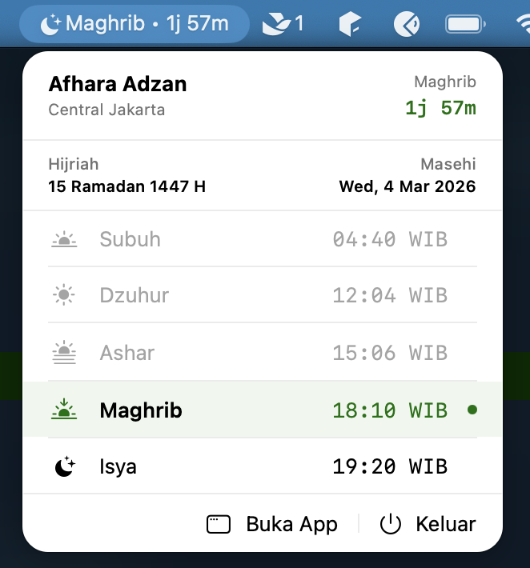
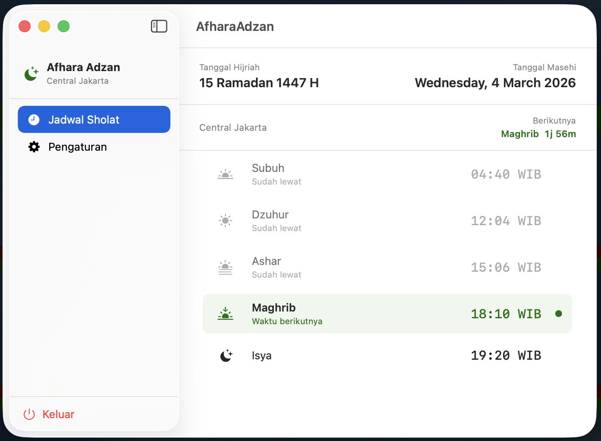

# Afhara Adzan

A minimal macOS menu bar app for Islamic prayer time reminders. Lives quietly in your status bar and notifies you when it's time to pray.


---

## Screenshots

### Light Mode

| Menu Bar | Desktop |
|----------|---------|
|  |  |

### Dark Mode

| Menu Bar | Desktop |
|----------|---------|
|  |  |

---

## Features

- **Status bar countdown** — shows next prayer name and time remaining, updates every second
- **Prayer schedule** — all 5 fardhu prayers calculated for your current location
- **Calculation method** — choose between Kemenag RI, MWL, ISNA, Umm al-Qura, or Egyptian
- **Adzan audio** — plays MP3 at prayer time, stoppable from the menu bar
- **Multiple sounds** — Makkah and Madinah adzan included, easily extendable
- **Banner notifications** — macOS notification at each prayer time, configurable per prayer
- **Auto location** — detects your city via GPS, or set manually
- **Syuruq toggle** — optionally show Syuruq in the schedule (no notification or audio)
- **Theme switcher** — Light, Dark, or follow System preference
- **Dual date display** — shows Hijri (Islamic) and Gregorian date
- **Timezone label** — prayer times shown with WIB / WITA / WIT label based on your location

---

## Installation

### Option 1 — Download DMG (Recommended)

1. Go to the [latest release](https://github.com/irwancannadys/afhara-adzan/releases/latest)
2. Download `AfharaAdzan-vX.X.X.dmg`
3. Open the DMG, drag **AfharaAdzan** to **Applications**
4. **First launch:** right-click → **Open** (instead of double-clicking)
   > macOS will block the app on first double-click because it is not notarized.
   > After allowing it once, it opens normally.

**Alternative via Terminal:**
```sh
xattr -cr /Applications/AfharaAdzan.app
```

### Option 2 — Build from Source

```bash
git clone https://github.com/irwancannadys/afhara-adzan.git
cd afhara-adzan/AfharaAdzan
open AfharaAdzan.xcodeproj
```

Then press **⌘R** in Xcode.

> **Note:** On first build, Xcode may ask you to set a Development Team under **Signing & Capabilities**. Select your Apple ID or any available team.

---

## Calculation Method

Supports multiple calculation methods. Default is **Kemenag RI** (Indonesian Ministry of Religious Affairs).

| Method | Fajr | Isha |
|--------|------|------|
| Kemenag RI | 20° | 18° |
| Muslim World League | 18° | 17° |
| ISNA | 15° | 15° |
| Umm al-Qura | 18.5° | Maghrib + 90 min |
| Egyptian | 19.5° | 17.5° |

Asr uses **Shafi'i madhab** (shadow factor 1×) for all methods.

---

## Usage

1. App appears in the **status bar** — click the icon to view the prayer schedule
2. Click **Open App** to open the full desktop window
3. Open **Settings** to configure location, notifications, sound, and calculation method
4. **Stop Adzan** button appears automatically in the menu bar when audio is playing

---

## Architecture

Built with SwiftUI using `@Observable` + `@MainActor` (Swift 5.9).

```
AfharaAdzanApp
├── MenuBarExtra          ← status bar icon + popover
│   ├── MenuBarLabel      ← icon + next prayer + countdown
│   └── MenuBarView       ← prayer list + quick actions
└── WindowGroup           ← desktop window
    └── MainWindowView    ← NavigationSplitView
        ├── ScheduleDetailView
        └── SettingsView

Core/
├── AppState              ← single source of truth (@Observable)
├── Models/               ← PrayerTime, LocationModel, PrayerSettings
└── Services/
    ├── PrayerTimeCalculator  ← multi-method algorithm (pure struct)
    ├── LocationService       ← CoreLocation wrapper
    ├── NotificationService   ← UNUserNotificationCenter
    └── AudioService          ← AVFoundation
```

`AppState` runs two timers: a 60-second timer to recalculate prayer times and a 1-second timer to update the countdown string. Prayer audio is scheduled via dedicated `Timer` instances, separate from notifications. Schedule auto-refreshes at midnight without requiring an app restart.

---

## License

MIT
